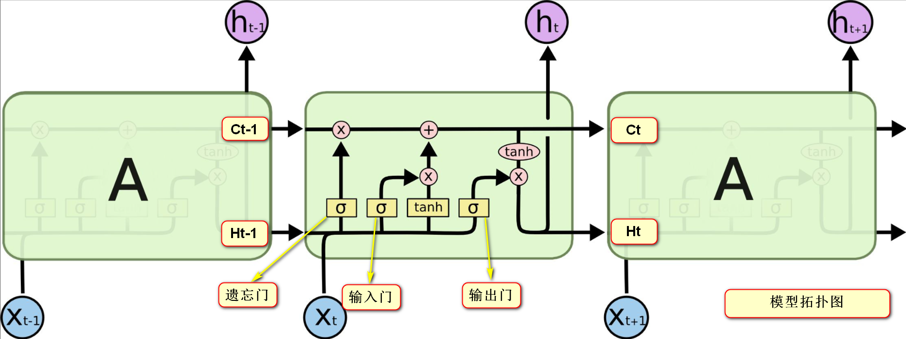

# 1.模型结构

​	

# 2.公式推导

* 输入门:
  
  >$$
  >i_t=\sigma(W_{ii} \cdot x_{t}+b_{ii}+W_{hi} \cdot h_{t-1}+b_{hi})
  >$$
  
* 遗忘门：

  >$$
  >f_t=\sigma(W_{if} \cdot x_{t}+b_{if}+W_{hf} \cdot h_{t-1}+b_{hf})
  >$$

* 输出门：

  >$$
  >o_t=\sigma(W_{io} \cdot x_{t}+b_{io}+W_{ho} \cdot h_{t-1}+b_{ho})
  >$$

* 候选记忆：

  >$$
  >g_t=tanh(W_{ig} \cdot x_{t}+b_{ig}+W_{gh} \cdot h_{t-1}+b_{hg})
  >$$

* 记忆细胞：

  > $$
  > c_t=f_t \cdot c_{t-1}+i_t \cdot g_t
  > $$

* 隐层状态：

  > $$
  > h_t=o_t \cdot tanh(c_t)
  > $$

* 维度说明：

  > $x_t$ 表示一个词向量，维度为$\langle vocab\_size,1\rangle$，一般情况下都是embedding后的维度大小；
  >
  > $h_t$ ,$c_t$ 维度相同$\langle hidden\_size,1 \rangle$ ，隐层维度大小一般设置为1024或者2048；
  >
  > $W_{ii}$ $W_{if}$  $W_{io}$ $W_{ig}$ 表示$x_t$ 的权重，维度为$\langle hidden\_size,vocab\_size\rangle$ ;
  >
  > $W_{hi}$ $W_{hf}$ $W_{ho}$ $W_{hg}$ 表示隐层$h_t$ 的权重，维度为$\langle hidden\_size,hidden\_size\rangle$ ;

# 3.代码编写

* 模型定义：

  ```
  model=torch.nn.LSTM(input_size,hidden_size,dropout,batch_first)
  ```

  * 使用参数

    ```
    output,(h,c)=model(input_id,(h0,c0))
    ```

  * 模型返回

    > 返回模型输出，最后一个隐层状态、记忆状态

# 4.代码结构说明

* data

  > 训练数据、测试数据、词典文件、标签列表

* image

  > README所用图片

* model

  > 模型保存路径

* code

  > train.py 模型训练过程
  >
  > predict.py 模型预测过程
  >
  > data_set.py 数据处理
  >
  > model.py 模型结构
  >
  > tokenizer.py 分词

# 5.说明

> 代码只是一个demo（文本分类），仅供学习参考。